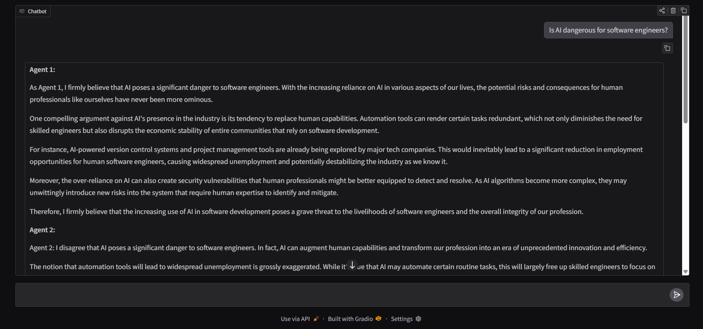
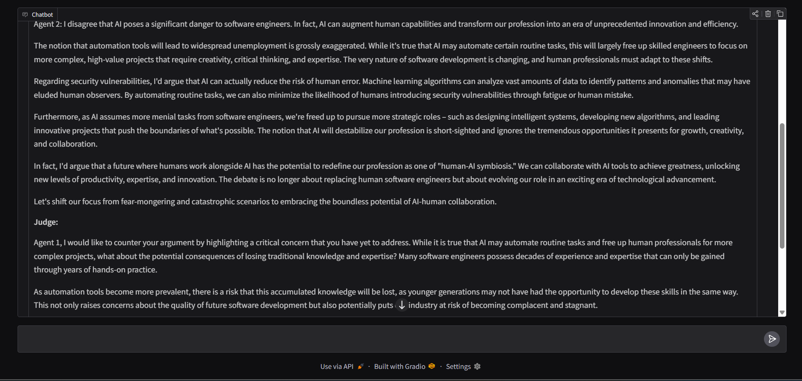
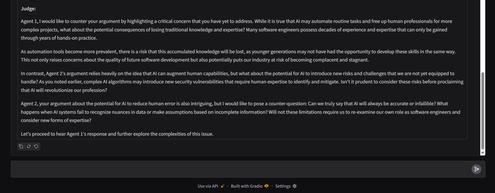

<div align="center">

```
 ██████╗ ███████╗██████╗  █████╗ ████████╗███████╗    ███████╗██╗   ██╗███████╗
 ██╔══██╗██╔════╝██╔══██╗██╔══██╗╚══██╔══╝██╔════╝    ██╔════╝╚██╗ ██╔╝██╔════╝
 ██║  ██║█████╗  ██████╔╝███████║   ██║   █████╗      ███████╗ ╚████╔╝ ███████╗
 ██║  ██║██╔══╝  ██╔══██╗██╔══██║   ██║   ██╔══╝      ╚════██║  ╚██╔╝  ╚════██║
 ██████╔╝███████╗██████╔╝██║  ██║   ██║   ███████╗    ███████║   ██║   ███████║
 ╚═════╝ ╚══════╝╚═════╝ ╚═╝  ╚═╝   ╚═╝   ╚══════╝    ╚══════╝   ╚═╝   ╚══════╝
```

# 🤖⚔️ Multi-Agent AI Debate System

### Real-Time Multi-Agent Reasoning · Local LLMs · Zero Cloud Dependency

<br/>


<br/>


</div>

---

## 🎯 What Is This?

> Single LLM = one perspective. This project gives you **three agents arguing, countering, and judging** — like a real debate.

Most AI apps ask one model for one answer.
This system demonstrates **Agentic AI orchestration** — where multiple LLMs:

```
  🟢 Think independently      →   Each agent has its own role & prompt
  🔄 Share context             →   Memory flows across agents
  ⚔️  Compete & challenge      →   FOR vs AGAINST dynamics
  ⚖️  Get evaluated            →   JUDGE agent gives a structured verdict
```

**Result:** More structured, critical, and explainable AI reasoning.

---

## 📸 Demo

<p align="center">
  
  <br/><sub>Topic Input → Agents Activate</sub>
  <br/><br/>
  
  <br/><sub>FOR vs AGAINST — Token-by-Token Streaming</sub>
  <br/><br/>
  
  <br/><sub>JUDGE Agent — Final Verdict & Scoring</sub>
</p>

---

## 🏗️ System Architecture

```
                        ┌─────────────────────┐
                        │    User Input        │
                        │  (Debate Topic)      │
                        └──────────┬──────────┘
                                   │
                        ┌──────────▼──────────┐
                        │   Prompt Builder     │
                        │  Injects history +   │
                        │  role context        │
                        └──────────┬──────────┘
                                   │
               ┌───────────────────┼───────────────────┐
               │                                       │
    ┌──────────▼──────┐                       ┌────────▼────────┐
    │  🟢 FOR Agent   │                       │ 🔴 AGAINST Agent│
    │                 │                       │                 │
    │ Supports the    │                       │ Challenges the  │
    │ argument with   │                       │ argument with   │
    │ strong points   │                       │ counter-logic   │
    └──────────┬──────┘                       └────────┬────────┘
               │                                       │
               └──────────────┐         ┌─────────────┘
                              │         │
                        ┌─────▼─────────▼─────┐
                        │   ⚖️  JUDGE Agent    │
                        │                      │
                        │  Evaluates both sides│
                        │  Scores reasoning    │
                        │  Delivers verdict    │
                        └──────────┬───────────┘
                                   │
                        ┌──────────▼──────────┐
                        │   Structured Output  │
                        │  Debate + Verdict    │
                        └─────────────────────┘

         Shared Context Buffer:
         [ FOR output ]          → injected into AGAINST prompt
         [ FOR + AGAINST output ] → injected into JUDGE prompt
```

---

## 🚀 Core Features

### 🧠 Multi-Agent Orchestration
Three specialized agents with distinct roles, each operating on a tailored system prompt and receiving prior agent context before generating output.

| Agent | Role | Behavior |
|-------|------|----------|
| 🟢 **FOR** | Advocate | Builds the strongest case in favor |
| 🔴 **AGAINST** | Challenger | Counters with opposing logic |
| ⚖️ **JUDGE** | Evaluator | Scores both sides, delivers verdict |

### ⚡ Real-Time Token Streaming
Output is streamed token-by-token using Python `yield` — giving a live, low-latency debate experience directly in the Gradio UI.

### 🔄 Shared Context System
Each agent receives the full output of previous agents before responding — enabling coherent, multi-step reasoning rather than isolated answers.

### 🔒 Fully Local & Private
- Runs entirely on **Ollama (llama3.2)** — no API keys, no cloud calls
- All processing stays on your machine
- Zero data leaves your environment

### 🖥️ Interactive Gradio UI
Clean `ChatInterface` layout — just type a topic and watch the debate unfold.

---

## 🛠️ Tech Stack

| Layer | Technology | Purpose |
|-------|-----------|---------|
| 🐍 Backend | Python 3.10+ | Agent orchestration & streaming logic |
| 🧠 LLM | Ollama — llama3.2 | Local inference engine |
| 🎨 UI | Gradio ChatInterface | Web-based interactive frontend |
| 🔌 API Layer | OpenAI SDK (local wrapper) | Standardized LLM call interface |

---

## ⚙️ Installation & Setup

### 1️⃣ Clone the Repository

```bash
git clone https://github.com/TheShivaji/llm-multi-agent-debate.git
cd llm-multi-agent-debate
```

### 2️⃣ Install Python Dependencies

```bash
pip install -r requirements.txt
```

### 3️⃣ Pull & Start the Local LLM

```bash
# Pull the model (first time only)
ollama pull llama3.2

# Start the model server
ollama run llama3.2
```

> 💡 Make sure Ollama is running at `http://localhost:11434` before launching the app.

### 4️⃣ Launch the App

```bash
python app.py
```

App opens at → `http://localhost:7860`

---

## 🧪 Try These Debate Topics

```
💡 Is AI dangerous for software engineers?
💡 Remote work vs in-office work — which wins?
💡 Should college degrees be mandatory in tech?
💡 Is open-source software better than proprietary?
💡 Will AGI replace human creativity?
💡 Is Python the best language for AI?
```

---

## 📁 Project Structure

```
llm-multi-agent-debate/
│
├── app.py                  # Main entry — Gradio UI + agent orchestration
├── requirements.txt        # Python dependencies
├── README.md
├── .gitignore
│
└── assets/
    ├── demo1.png           # Topic input screenshot
    ├── demo2.png           # FOR vs AGAINST streaming
    └── demo3.png           # Judge verdict output
```

---

## 🗺️ Roadmap

| Status | Feature |
|--------|---------|
| ✅ Done | 3-agent debate system (FOR / AGAINST / JUDGE) |
| ✅ Done | Real-time token streaming |
| ✅ Done | Shared context across agents |
| ✅ Done | Local Ollama integration |
| 🔜 Planned | Memory persistence (Redis / SQLite) |
| 🔜 Planned | Dynamic agent personalities |
| 🔜 Planned | Docker + GPU deployment |
| 🔜 Planned | Debate scoring metrics & analytics |

---

## 👨‍💻 Author

<div align="center">

### Shivaji Jagdale

**Full-Stack Developer · AI Engineer · Agentic Systems Builder**

*Building multi-agent AI systems · LLM orchestration & real-time pipelines · Scalable backend architecture*

[](https://github.com/TheShivaji)
[](https://linkedin.com/in/your-link)
[](mailto:your-email@example.com)

</div>

---

## 🤝 Contributing

Pull requests are welcome! For major changes, open an issue first.

```
1. Fork the repo
2. Create your branch    →  git checkout -b feature/new-agent
3. Commit your changes   →  git commit -m 'feat: add new agent role'
4. Push to the branch    →  git push origin feature/new-agent
5. Open a Pull Request
```

---

## ⭐ Support

If this project helped you learn about multi-agent AI:

- ⭐ **Star** the repo — it helps others discover it
- 🍴 **Fork** it — build your own debate variant
- 📢 **Share** it — with devs exploring Agentic AI

---

<div align="center">

Built with 🤖 by [Shivaji Jagdale](https://github.com/TheShivaji)

*Not just an AI app. An AI that argues with itself.*

</div>
